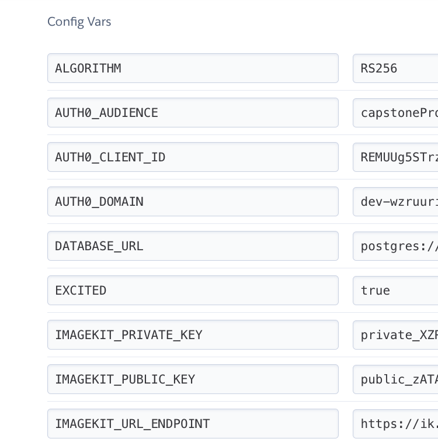

# Full Stack Udacity Capstone

## Introduction

The aim of this project is having a first approach to image handling in web pages.
Particularly, it consists in deploying a site to share images. Any who accesses the site will be able to see the content, but only people with right permissions will be allowed to create albums and upload images.

Even when images can be stored in a database as binaries, this is not always the best thing to do. In general terms, it would be better storing the images in the disk or in the cloud and then save in the database the place where the images are. In this project, the cloud alternative is chosen.

## Demo

 Heroku app: https://jogallar-capstone-app-fd00b6e0aac4.herokuapp.com/

 The roles and permissions are presented in the next table.

|                | avatarRole    | AlbumManager   |
| ---------------| ------------- | -------------  |
| post:albums    | ✔️            | ❌              |
| patch:albums   | ✔️            | ❌              |
| delete:albums  | ✔️            | ❌              |
| post:images    | ✔️            | ✔️              |
| delete:images  | ✔️            | ✔️              |


* Unauthenticated users or users with no permissions can only see the content:

https://github.com/jantonio07/full_stack_udacity_capstone/assets/15172655/31dcba3e-95d2-4658-a87a-ee4a8a7f0a38

* In addition to see the content, users with `AlbumManager` role can upload and delete images from albums:

https://github.com/jantonio07/full_stack_udacity_capstone/assets/15172655/b3acccf9-2118-41a7-9a5e-1f046fdc76fc

* Besides seeing the content and uploading/deleting images, users with `avatarRole` can also create, delete and rename albums:


https://github.com/jantonio07/full_stack_udacity_capstone/assets/15172655/22f30e4d-102b-4a91-bd3c-57b6e4793998


## Tech Stack

* Media management: [ImageKit](https://imagekit.io/).
* Authentication and authorization: [Auth0](https://auth0.com/).
* Database system: [PostgreSQL](https://www.postgresql.org/).
* Backend-Python3: [Flask](https://flask.palletsprojects.com/en/3.0.x/), [SQLAlchemy](https://www.sqlalchemy.org/), [Flask-Migrate](https://flask-migrate.readthedocs.io/en/latest/).
* Fronted-Javascript: [knockout](https://knockoutjs.com/).
* Cloud platform as a service: [Heroku](https://dashboard.heroku.com/).

## Local development instructions

The project needs some environment variables and configuration to run:

* ImageKit: `IMAGEKIT_PRIVATE_KEY`, `IMAGEKIT_PUBLIC_KEY` and `IMAGEKIT_URL_ENDPOINT`. These allow us to use the ImageKit API to upload and delete images to an account. A pretty good and straightforward tutorial is [1].
* Auth0: `AUTH0_DOMAIN`, `AUTH0_CLIENT_ID` and `AUTH0_AUDIENCE`. At high level, we need a single page web application and an API to set roles and permissions. The `AUTH0_DOMAIN` and `AUTH0_CLIENT_ID` variables are obtained from the application and `AUTH0_AUDIENCE` from the API. For more details see [2]. Just as comment: the official Auth0 quick start when an application is created is pretty good to set the authentication in the front-end, and as complement, [3] was really helpfull to set the API.

* PostgreSQL: `DATABASE_URL`. The user needs to create the database (`create database capstone;` can be run in `psql`) and then set the URL. To create the tables there are two options: uncomment `create_all` call in `app.py` or do the migration (more detail below).

It can be used `.env_var` to set the environment variables up, the `Users tokens` variables can be omitted until the app is running and testing is required (more detail in Testing section).

Once the variables are set, the dependencies can be installed (using a virtual environment is recommended) with `pip`:

```
python3 -m venv superEnv
source superEnv/bin/activate
pip install -r requirements.txt 
```

To initialize the database tables (do not forget initialize the environment variables):

```
source .env_var
flask db upgrade
```

To run the app:

```
FLASK_DEBUG=1 flask --app app --debug run
```

## Testing

If the app is running the tokens can be obtained using the front-end. When the user is authenticated its token is logged in console. Something like this:

`USER TOKEN: abkuesdyr8734hfjw.wdufh34ofeiuqw4.feq94uhrjwf`

When the tokens for different roles are gotten they can be set using `.env_var` and then run the tests:

```
python3 app_test.py
```

⚠️ WARNING: The database is cleaned when testing ⚠️

## Heroku deployment instructions

A Heroku account is needed to perform all these steps. Worth to mention Heroku is not free anymore.

1. Create an app in Heroku:

`heroku create jogallar-capstone-app --buildpack heroku/python`

2. Once the app is created, validate git is able to push to the created repo (`git remote -v`). If not, this command may help:

`heroku git:remote -a jogallar-capstone-app`

3. Create a database for the app:
 
`heroku addons:create heroku-postgresql:mini --app jogallar-capstone-app`

5. Set environment variables in heroku app:



6. Push code to heroku app:

`git push heroku`

6. Create tables in database:

`heroku run flask db upgrade --app jogallar-capstone-app`

7. When the heroku app is deployed, add the URL app in the auth0 application.


## API documentation

|                | avatarRole    | AlbumManager   | 
| ---------------| ------------- | -------------  |
| post:albums    | ✔️            | ❌              |
| patch:albums   | ✔️            | ❌              |
| delete:albums  | ✔️            | ❌              |
| post:images    | ✔️            | ✔️              |
| delete:images  | ✔️            | ✔️              |


|        | albums        | images         |
| -------| ------------- | -------------  |
| GET    | All users     | All users      |
| POST   | post:albums   | post:images    |
| PATCH  | patch:albums  | N/A |
| DELETE | delete:albums | delete:images  |

---

`GET '/albums'`

- Fetch the albums available in the app.
- Returns: An array with all the albums.

Example:

`curl --location 'https://jogallar-capstone-app-fd00b6e0aac4.herokuapp.com/albums'`

```json
{
    "albums": [
        {
            "id": 1,
            "name": "Guanajuato de mi corazón"
        },
        {
            "id": 2,
            "name": "Perrito"
        },
        {
            "id": 3,
            "name": "Running"
        },
        {
            "id": 4,
            "name": "Wonderland trip"
        }
    ],
    "success": true
}
```

---

`GET '/albums/<int:albumId>/images'`

- Fetch the images available in an album.
- Request Arguments: The id of the album.
- Returns: An array with all the albums.

Example:

`curl --location 'https://jogallar-capstone-app-fd00b6e0aac4.herokuapp.com/albums/1/images'`

```json
{
    "images": [
        {
            "albumId": 1,
            "h": 1600,
            "id": 1,
            "url": "https://ik.imagekit.io/ynuyx2nqou/image_uHpQH7Mzr.jpeg",
            "w": 1200
        },
        {
            "albumId": 1,
            "h": 1200,
            "id": 3,
            "url": "https://ik.imagekit.io/ynuyx2nqou/image_8gFEWJ-qd-.jpeg",
            "w": 1600
        },
        {
            "albumId": 1,
            "h": 1200,
            "id": 4,
            "url": "https://ik.imagekit.io/ynuyx2nqou/image_wvs3aG7qn.jpeg",
            "w": 1600
        }
    ],
    "success": true
}
```
---
`POST '/albums'`

- Request to create a new album.
- Request Body:

```json
{
    "albumName": "New album name"
}
```
- Headers: `Content-Type: application/json` and Bearer token in `Authorization` header.
- Returns: An array with the new album.

Example:

`curl --location 'https://jogallar-capstone-app-fd00b6e0aac4.herokuapp.com/albums' --header 'Content-Type: application/json' --header 'Authorization: Bearer theTokenGoesHere' --data '{
    "albumName": "API Album"
}'`

```json
{
    "albums": [
        {
            "id": 6,
            "name": "API Album"
        }
    ],
    "success": true
}
```
---
`POST '/albums/<int:albumId>/images'`

- Request to add a photo to an album.
- Request Arguments: The id of the album.
- Request Body: Image file in `form-data`
- Headers: Bearer token in `Authorization` header.
- Returns: An array with the new image.

Example:

`curl --location 'https://jogallar-capstone-app-fd00b6e0aac4.herokuapp.com/albums/7/images' --header 'Authorization: Bearer theTokenGoesHere' --form 'file=@"/Users/jogallar/Documents/nanodegree/capstone/avatar_1.jpg"'`

```json
{
    "images": [
        {
            "albumId": 7,
            "h": 900,
            "id": 9,
            "url": "https://ik.imagekit.io/ynuyx2nqou/image_clJLpxKKz.jpeg",
            "w": 900
        }
    ],
    "success": true
}
```

---

`PATCH '/albums/<int:albumId>'`

- Request to modify the name of an album.
- Request Arguments: The id of the album.
- Request Body: 
```json
{
    "newName": "newName 2.0"
}
```
- Headers: `Content-Type: application/json` and Bearer token in `Authorization` header.
- Returns: An array with the renamed album.

Example:

`curl --location --request PATCH 'https://jogallar-capstone-app-fd00b6e0aac4.herokuapp.com/albums/7' --header 'Content-Type: application/json' --header 'Authorization: Bearer theTokenGoesHere' --data '{ "newName": "newName 2.0" }'`

```json
{
    "albums": [
        {
            "id": 7,
            "name": "newName 2.0"
        }
    ],
    "success": true
}
```
---

`DELETE '/images/<int:imageId>'`

- Request to delete an image.
- Request Arguments: The id of the image.
- Headers: The Bearer token in `Authorization` header.
- Returns: An integer with the id of the image deleted.

Example:

`curl --location --request DELETE 'https://jogallar-capstone-app-fd00b6e0aac4.herokuapp.com/images/11' --header 'Authorization: Bearer theTokenGoesHere'`

```json
{
    "delete": 11,
    "success": true
}
```

---

`DELETE '/albums/<int:albumId>'`

- Request to delete an album.
- Request Arguments: The album id.
- Headers: The Bearer token in `Authorization` header.
- Returns: An integer with the id of the album deleted.

Example:

`curl --location --request DELETE 'https://jogallar-capstone-app-fd00b6e0aac4.herokuapp.com/albums/7' --header 'Authorization: Bearer theTokenGoesHere'`

```json
{
    "delete": 7,
    "success": true
}
```

---

When there is an error the response has this format:

```json
{
    'success': False,
    'error': status-code,
    'message': error-message
}
```
---

## References

[1] FRIKIdelTO - 047 Subir imágenes a IMAGEKIT con la API (20GB GRATIS!!!) [curso Python]


[2] Udacity FSWD nanodegree - Setup Auth0


[3] auth0 repo - Custom query parameters with getTokenSilently


[1]: https://www.youtube.com/watch?v=5DQxzhP9LEw
[2]: https://github.com/jantonio07/Coffee_Shop_Full_Stack/tree/master/Project/03_coffee_shop_full_stack/starter_code/backend#setup-auth0
[3]: https://github.com/auth0/auth0-spa-js/issues/317


